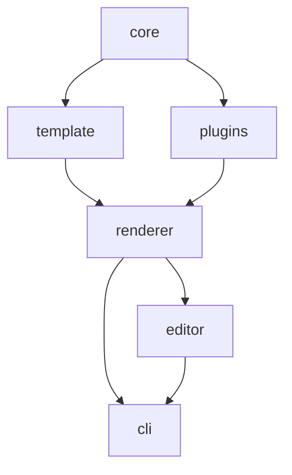

# JsonPDF

An open-source developer tool for designing templates and rendering PDFs using JSON data.

JsonPDF lets you define PDF templates as JSON, bind them to data, and render pixel-perfect PDFs. Templates can be authored by hand, via the CLI, or through a visual drag-and-drop editor.

[Live Demo](https://jsonpdf.com)

> **Alpha** — JsonPDF is under active development. The API may change and there are known bugs. Feedback and bug reports are welcome on [GitHub Issues](https://github.com/jsonpdf/jsonpdf/issues).

## Getting Started

Install the CLI globally:

```sh
npm install -g @jsonpdf/cli
```

Scaffold a new template, then render it:

```sh
jsonpdf init template.json
jsonpdf render -t template.json -d data.json -o output.pdf
```

Open the visual editor to design templates interactively:

```sh
jsonpdf editor template.json
```

## CLI Commands

| Command       | Description                                     |
| ------------- | ----------------------------------------------- |
| `init`        | Scaffold a new template project                 |
| `validate`    | Validate a template against the JSON Schema     |
| `render`      | Render a template to PDF (supports `--watch`)   |
| `sample-data` | Generate sample data from the template's schema |
| `editor`      | Launch the visual drag-and-drop template editor |

## Packages



`cli` and `editor` also depend on `template` and `core` directly.

| Package                                  | Description                                                                   |
| ---------------------------------------- | ----------------------------------------------------------------------------- |
| [`@jsonpdf/core`](packages/core)         | Shared types, utilities, JSON Schema validation                               |
| [`@jsonpdf/template`](packages/template) | Immutable template factory, CRUD operations, validation                       |
| [`@jsonpdf/plugins`](packages/plugins)   | Element type implementations (text, image, line, table, chart, barcode, etc.) |
| [`@jsonpdf/renderer`](packages/renderer) | PDF generation pipeline: validate, resolve, measure, layout, render           |
| [`@jsonpdf/cli`](packages/cli)           | CLI for template management and rendering                                     |
| [`@jsonpdf/editor`](packages/editor)     | Visual drag-and-drop template designer (React + Konva)                        |

See [docs/architecture.md](docs/architecture.md) for the full content model, type definitions, band types, plugin interface, rendering pipeline, and a complete invoice example.

## Documentation

| Guide                                          | Description                                                        |
| ---------------------------------------------- | ------------------------------------------------------------------ |
| [Getting Started](docs/getting-started.md)     | Installation, first template, data binding, and editor walkthrough |
| [Template Guide](docs/template-guide.md)       | Template structure, sections, bands, data binding, and expressions |
| [Element Reference](docs/elements.md)          | All 10 element types with properties, defaults, and examples       |
| [Styling](docs/styling.md)                     | Style resolution, named styles, rich text, fonts, and gradients    |
| [Advanced Features](docs/advanced-features.md) | Multi-section layouts, columns, bookmarks, TOC, grouping, and more |
| [CLI Reference](docs/cli-reference.md)         | All commands and options                                           |
| [Rendering API](docs/rendering-api.md)         | Programmatic rendering in Node.js and the browser                  |
| [Architecture](docs/architecture.md)           | Internal design, content model, and rendering pipeline             |

## Tech Stack

| Library           | Purpose                                           |
| ----------------- | ------------------------------------------------- |
| TypeScript        | Type safety across all packages                   |
| pnpm workspaces   | Monorepo management                               |
| Vitest            | Testing                                           |
| pdf-lib           | PDF generation (pure JS, works in browser + Node) |
| @pdf-lib/fontkit  | Font embedding and subsetting                     |
| liquidjs          | Template expressions, filters, conditionals       |
| ajv               | JSON Schema validation                            |
| @resvg/resvg-js   | SVG rasterization for embedding in PDFs (Node)    |
| @resvg/resvg-wasm | SVG rasterization for browser environments        |
| fontsource        | Open source font loading                          |
| commander         | CLI argument parsing                              |
| chalk             | CLI terminal styling                              |
| bwip-js           | Barcode and QR code generation                    |
| React + Konva     | Editor canvas and UI                              |
| Monaco Editor     | JSON data editor in preview panel                 |
| vega-lite         | Chart rendering                                   |

## License

[MIT](LICENSE)
